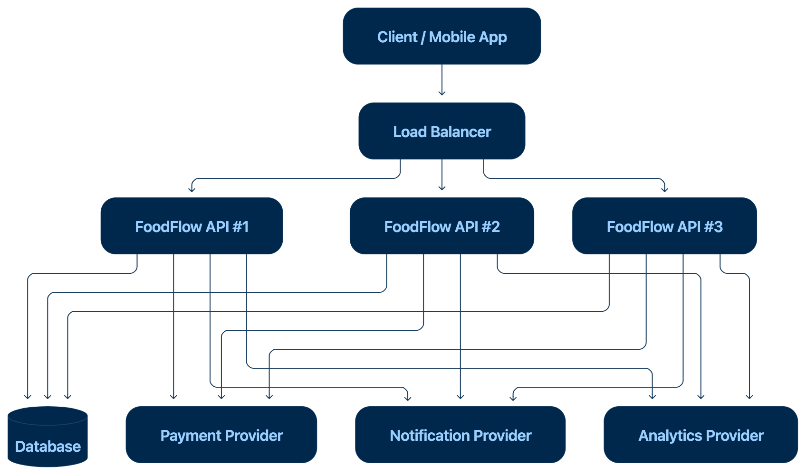
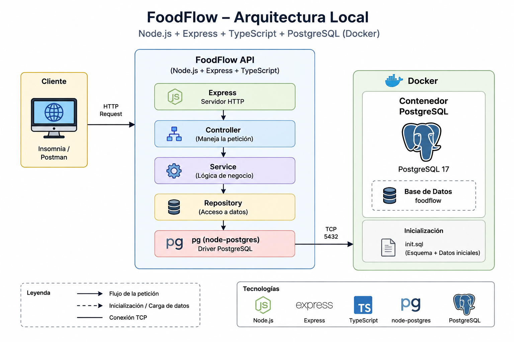
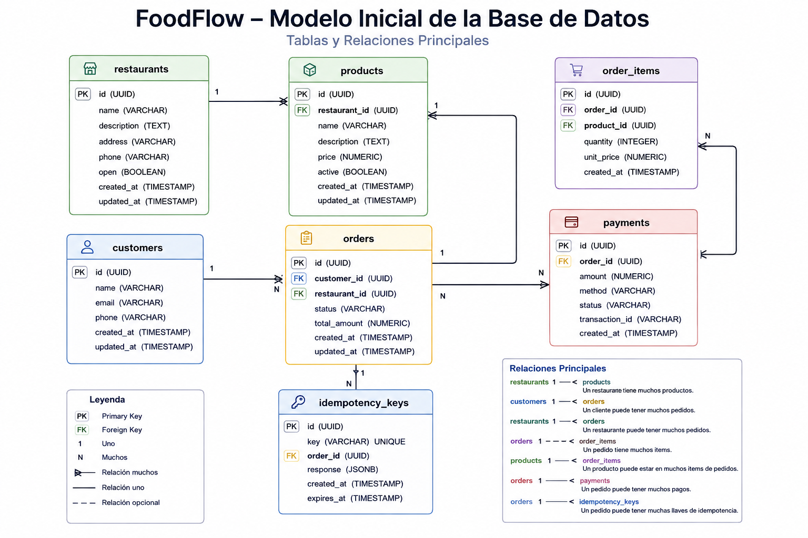
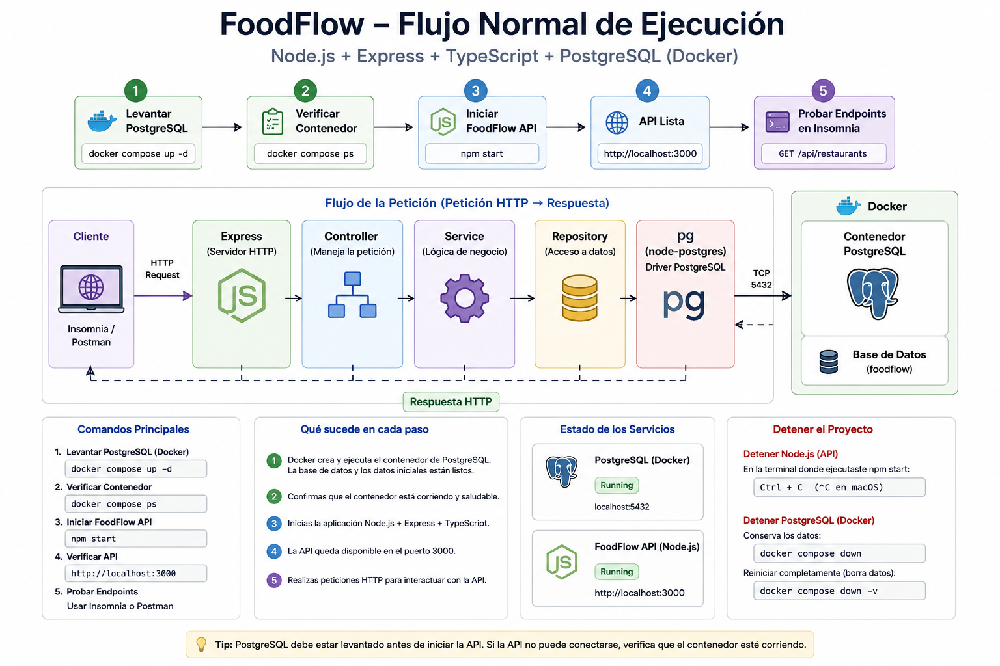
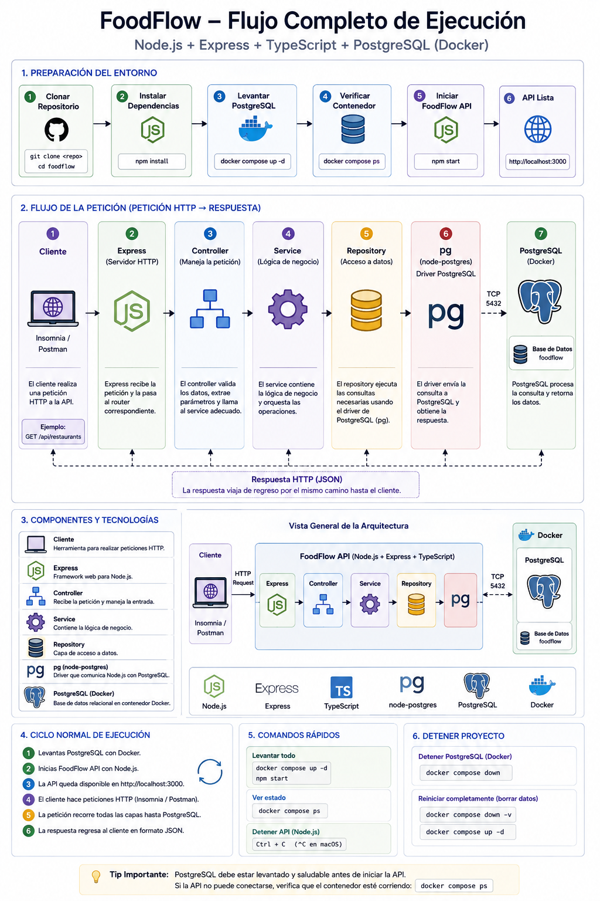

# FoodFlow production incident

<p align="center">
  
</p>

# FoodFlow PostgreSQL + Docker

Esta variante de **FoodFlow** utiliza PostgreSQL como sistema de persistencia y Docker para ejecutar la base de datos localmente.

## Arquitectura local

<p align="center">
  
</p>

## Requisitos

Antes de ejecutar el proyecto necesitas:

- Node.js
- npm
- Docker Desktop
- Git
- Un cliente HTTP como Insomnia o Postman

Puedes verificar Docker utilizando:

```bash
docker --version
docker compose version
```

## Primera ejecución

```bash
git clone <repository-url>
cd foodflow

npm install

docker compose up -d
docker compose ps

npm start
```

---

## Ejecuciones posteriores

```bash
docker compose up -d
npm start
```

---

## Detener el proyecto

Detener Node.js:

```text
Control + C
```

Detener PostgreSQL:

```bash
docker compose down
```

---

## Reconstruir completamente PostgreSQL

```bash
docker compose down -v
docker compose up -d
```

---

## Diagnóstico

Estado:

```bash
docker compose ps
```

Logs:

```bash
docker logs foodflow-postgres
```

Entrar a PostgreSQL:

```bash
docker exec -it foodflow-postgres psql -U foodflow -d foodflow
```

---

El proyecto utiliza `pg` como driver de PostgreSQL para Node.js.

Las dependencias correspondientes son:

```bash
npm install pg
npm install -D @types/pg
```

Si ejecutaste `npm install` después de clonar el repositorio, no necesitas instalarlas individualmente porque ya estarán declaradas en `package.json`.

---

## Estructura relacionada con PostgreSQL

```text
foodflow/
├── database/
│   └── init.sql
│
├── src/
│   ├── database/
│   │   └── postgres.ts
│   │
│   ├── repositories/
│   │   └── restaurant.repository.ts
│   │
│   └── ...
│
├── compose.yaml
├── .env.example
├── package.json
└── README.md
```

### `compose.yaml`

Define el contenedor de PostgreSQL utilizado por FoodFlow.

### `database/init.sql`

Inicializa la base de datos y contiene:

- creación de tablas;
- relaciones;
- constraints;
- datos iniciales para pruebas.

### `src/database/postgres.ts`

Configura el pool de conexiones utilizado por Node.js para comunicarse con PostgreSQL.

---

# Base de datos

La configuración local por defecto es:

| Propiedad | Valor         |
| --------- | ------------- |
| Host      | `localhost`   |
| Puerto    | `5432`        |
| Database  | `foodflow`    |
| User      | `foodflow`    |
| Password  | `foodflow123` |

> Estas credenciales corresponden únicamente al ambiente local del proyecto.

---

## Modelo inicial

La base de datos contiene las siguientes tablas:

```text
restaurants
customers
products
orders
order_items
payments
idempotency_keys
```

Las relaciones principales son:

<p align="center">
  
</p>

---

# Verificar PostgreSQL manualmente

Puedes conectarte directamente a PostgreSQL utilizando:

```bash
docker exec -it foodflow-postgres psql -U foodflow -d foodflow
```

Dentro de PostgreSQL puedes consultar las tablas:

```sql
\dt
```

Consultar restaurantes:

```sql
SELECT * FROM restaurants;
```

Consultar productos:

```sql
SELECT * FROM products;
```

Para salir de PostgreSQL:

```text
\q
```

La API estará disponible en:

```text
http://localhost:3000
```

---

# Flujo normal de ejecución

Cada vez que quieras trabajar con FoodFlow puedes utilizar:

```bash
docker compose up -d
docker compose ps
npm start
```

Una vez iniciado:

<p align="center">
  
</p>

---

# Probar la API

## Obtener restaurantes

```http
GET http://localhost:3000/api/restaurants
```

## Obtener un restaurante

```http
GET http://localhost:3000/api/restaurants/restaurant-1
```

## Modificar disponibilidad

```http
PATCH http://localhost:3000/api/restaurants/restaurant-1/open
```

Body:

```json
{
  "open": false
}
```

Después puedes consultar nuevamente:

```http
GET http://localhost:3000/api/restaurants/restaurant-1
```

---

# Reiniciar completamente la base de datos

El archivo:

```text
database/init.sql
```

se ejecuta cuando PostgreSQL inicializa por primera vez su volumen.

Por lo tanto, si modificas `init.sql` y quieres reconstruir completamente la base de datos, ejecuta:

```bash
docker compose down -v
```

y después:

```bash
docker compose up -d
```

Esto:

1. Detiene PostgreSQL.
2. Elimina el volumen.
3. Crea un volumen nuevo.
4. Crea nuevamente la base de datos.
5. Ejecuta `database/init.sql`.
6. Carga nuevamente los datos iniciales.

> **Advertencia:** `docker compose down -v` elimina todos los datos almacenados en la base de datos local.

Utilízalo únicamente cuando quieras reconstruir el ambiente desde cero.

# Para MongoDB

## Crear una orden

```http
POST http://localhost:3000/api/orders
```

```bash
Body:

{
  "customerId": "customer-1",
  "restaurantId": "restaurant-1",
  "items": [
    {
      "productId": "burger-1",
      "name": "Classic Burger",
      "quantity": 2,
      "price": 150
    }
  ],
  "total": 300,
  "status": "pending"
}
```

Guarda el \_id generado.

## Consultar órdenes

```http
GET http://localhost:3000/api/orders
GET http://localhost:3000/api/orders/<orderId>
```

## Actualizar estado

```http
PATCH http://localhost:3000/api/orders/<orderId>/status
```

```bash
Body:

{
  "status": "paid"
}
```

Estados permitidos:

- pending
- paid
- cancelled

## Eliminar orden

```http
DELETE http://localhost:3000/api/orders/<orderId>
```

## Comprobar persistencia

Crea una orden, detén Node.js y vuelve a iniciarlo:

```bash
npm start
```

Después consulta:

```http
GET http://localhost:3000/api/orders
```

---

# Flujo completo

<p align="center">
  
</p>
